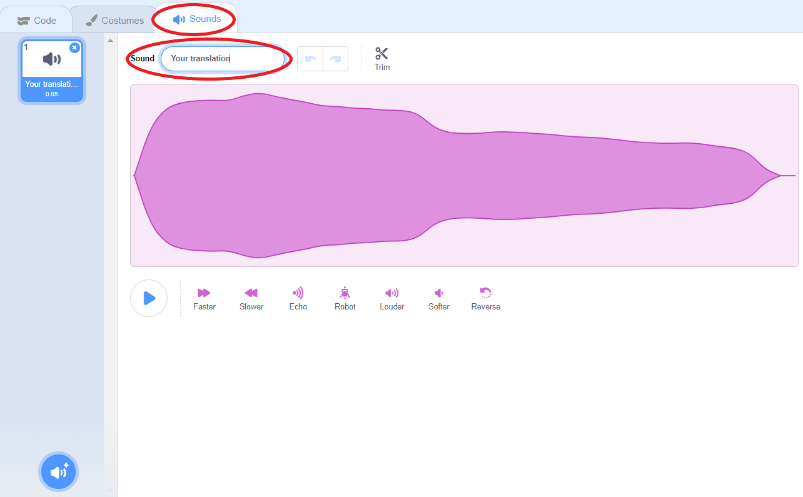
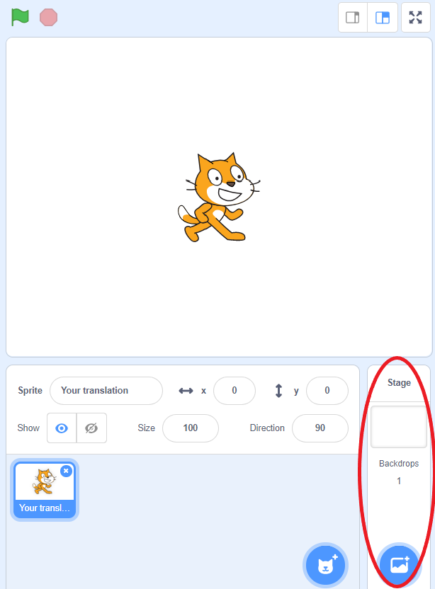
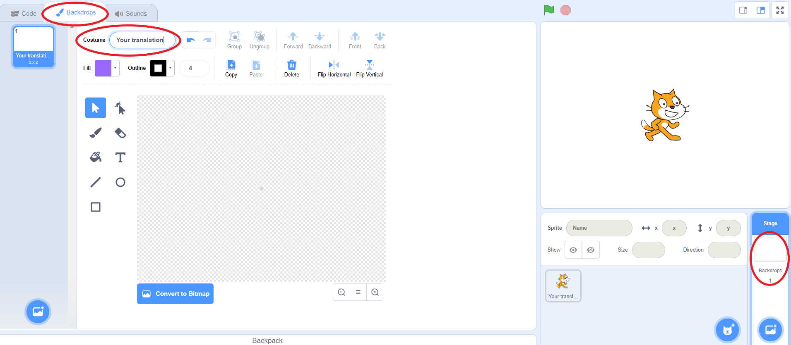
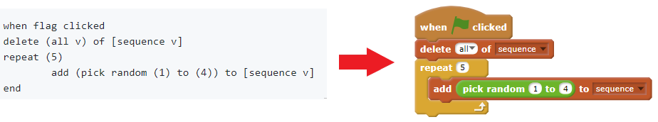

# Translating Scratch

**Before the launch of Scratch 3, please use the beta version available here: https://beta.scratch.mit.edu/**

Scratch is a visual programming language that helps young people learn to think creatively, reason systematically and work collaboratively. It enables kids to program their own interactive stories, games and animations. 

Scratch is available in a number of languages which means that the code in Scratch projects will need to be translated in line with the **official Scratch translation**. You can change the language of Scratch Editor by clicking the globe icon and selecting the language you're translating:

Changing the language will automatically translate the user interface and Scratch blocks but it won't translate names of variables, sprites, costumes, backdrops, sounds, or text in say/think/ask blocks and operator blocks - you will have to **translate these manually**.

**Note:**
If your language is not listed, you will still need to translate the abovementioned elements so please continue reading. 

## Names of sprites & costumes, backdrops and sounds

You can translate a sprite's name in the panel on the right:

Some sprites will have various costumes, such as the boat in the Boat Race project. To translate a sprite's costume names, click on the sprite and then go to the `Costumes` tab in the panel on the left. You will see the different costumes that the sprite has in the project, and you will be able to translate each of them:

The same applies to sounds:

Backdrops can be found in the panel on the right:

Click on the backdrop that you want to re-name and then click on the **Backdrops** tab in the panel on the left:

## Code

There may be some translation required in the `Code` tab, if there are any variables or text in say/think/ask blocks and operator blocks. You will need to check the code for every sprite and backdrop separetly.

To check for variables, please click on the `Variables` section of the `Code` tab. The screenshot below shows that there is a variable called `my variable`. 

To translate the name of the variable, right click on it and choose the `rename variable` option. Add your translation and click `OK`. Your translation will be automatically added wherever the variable is used. 

Finally, you will need to translate the text in white boxes:

Simply double click on the white box and translate the text. Please make sure that your translations here and in the project instructions are the same, to avoid confusion.

## Translating Scratch syntax in project instructions

When translating Scratch syntax in the markdown files, please use [this Scratch translator](http://scratchblocks.github.io/translator/). 

Please add your translation of the syntax in Crowdin exactly as it is displayed in the Scratch translator. Our website will display this syntax as Scratch blocks, like in the example below:

If you translate the syntax incorrectly (i.e. differently to what the Scratch translator suggests), the blocks will not be displayed correctly on the website.

If you have any questions, please contact Nina at nina@raspberrypi.org.
