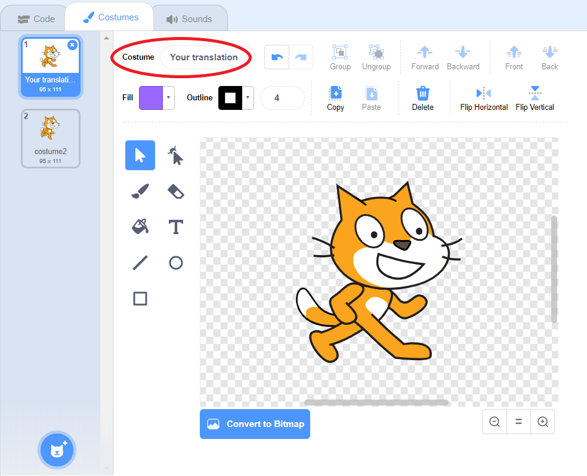

# Translating Scratch

Scratch is a visual programming language that helps young people learn to think creatively, reason systematically and work collaboratively. It enables kids to program their own interactive stories, games and animations. 

Scratch is available in a number of languages which means that the code in Scratch projects will need to be translated in line with the **official Scratch translation**. You can change the language of Scratch Editor by clicking the globe icon and selecting the language you're translating:

Changing the language will automatically translate the user interface and Scratch blocks but it won't translate names of variables, sprites, costumes, backdrops, sounds, or text in say/think/ask blocks and operator blocks - you will have to **translate these manually**.

**Note:**
If your language is not listed, you will still need to translate the abovementioned elements so please continue reading. 

## Names of sprites & costumes, backdrops and sounds

To change a sprite's name, right click on it and select `info`:

Type in your translation of the sprite's name, and click on the blue arrow to save it:

Some sprites will have various costumes, such as the boat in the Boat Race project. To translate a sprite's costume names, click on the sprite and then go to the `Costumes` tab in the middle panel. You will see the different costumes that the sprite has in the project, and you will be able to translate each of them:

The same applies to sounds and backdrops:

## Scripts

There may be some translation required in the `Scripts` tab, if there are any variables or text in say/think/ask blocks and operator blocks. You will need to check the scripts for every sprite and backdrop separetly.

To check for variables, please click on the Data section of the `Scripts` tab. The screenshot below shows that there is a variable called `name`. 

To translate the name of the variable, right click on it and choose the `rename variable` option. Add your translation and click `OK`. Your translation will be automatically added wherever the variable is used. 

Finally, you will need to translate the text in white boxes:

Simply double click on the white box and translate the text. Please make sure that your translations here and in the project instructions are the same, to avoid confusion.

## Translating Scratch syntax in project instructions

When translating Scratch syntax in the markdown files, please use [this Scratch translator](http://scratchblocks.github.io/translator/). This is what Scratch syntax looks like:

